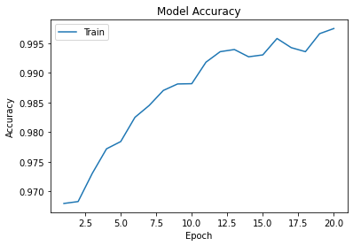
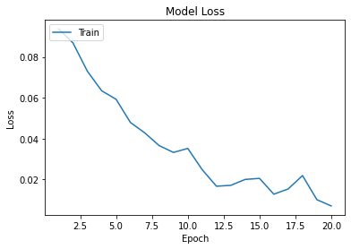

# Building a Malaria Classifier

## Acknowledgements 

The data for this project is publically avaialble from the Kaggle user [Aurnava](https://www.kaggle.com/iarunava/cell-images-for-detecting-malaria) and was initally collected from the [NIH malaria dataset](https://ceb.nlm.nih.gov/repositories/malaria-datasets/) repositories. 

This project follows the work of [Siraj Raval](https://github.com/llSourcell/AI_Startup_Prototype), and applies the CNN developed there in this context, with a few adjustments. 

## Background

Malaria is an infectious disease, which is mosquito-borne and is endemic within the equitorial belt. WHO estimates place the annual death toll of malaria at [405000](https://www.who.int/publications/i/item/world-malaria-report-2019) from their count in 2018. Patients infected with malaria present with flu-like symptoms, and can encompas headaches, fevers and nausea. More severe and complicated cases can result in actue respiratory distress syndrome, encephalopathy, seizures, coma and eventually death. New technologies are being developed to combat the detrimental effects of malaria, and to reduce the mortality of the disease.

Current Malaria tests are conducted via microscopic examination, etheir though antigen dereived rapid diagnositc tests or through blood films, and visual confirmation of parasitic invasion within the red blood cells. This current testing methodology has several drawbacks, firstly being that result accuracy relies on having a specifically skilled scientist identify the parasite, which leads on to limiting the throughput of the test in a high volume setting. Machine learning can be applied to this context to aid the identification of parasitised cells at a higher throughput.

Convolutional nerual networks (CNN) perform well at image classification, therefore training a CNN to identify parasitised and uninfected cells could be beneficial. 

## Results 

Tensorflow retraining of the ResNet pretrained imageset was conducted to 20 epochs, and yielded an accuracy greater than 0.995 and a loss of 0.007.

